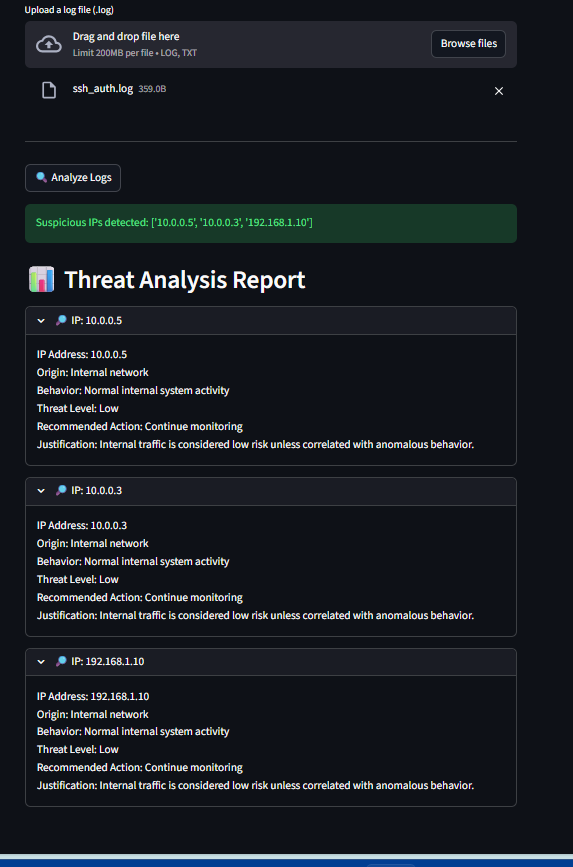

# AI SOC Analyst

AI SOC Analyst is a Streamlit app that uses **GPT-2** to analyze log files, detect suspicious activity, and provide easy-to-understand explanations.

---

## Features

- Upload `.log` files for analysis  
- Detect suspicious IPs and events  
- GPT-2 generates human-readable explanations  
- Simple web interface using Streamlit  

---

## Installation

1. Clone the repository:  
```bash
git clone <your-repo-url>
cd AI-SOC-Analyst
````

2. Install dependencies:

```bash
pip install -r requirements.txt
```

3. Make sure you have the GPT-2 model downloaded locally and update the `MODEL_PATH` in `app.py` or `llm_analyzer.py` if needed:

```python
MODEL_PATH = r"C:\Users\asgaj\models\gpt2"  # Change this path if your model is elsewhere
```

> The GPT-2 model is included separately; no Hugging Face token or internet connection is required.

---

## Usage

Run the app:

```bash
streamlit run app.py
```

1. Ensure `MODEL_PATH` points to your GPT-2 model folder.
2. Upload your `.log` file
3. Click **Analyze**
4. View the suspicious activity report

---

## Demo

Here’s how the AI SOC Analyst app looks:




## Technologies Used

* Python 3
* Streamlit
* GPT-2 (local model)
* Pandas & Regex for log parsing

---

## License

This project is licensed under the **MIT License** – see the [LICENSE](LICENSE) file for details.

one who clones your repo can run it without issues. Do you want me to do that?

